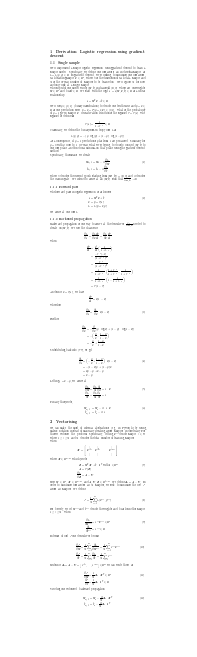

# ml-impl
Houses some machine learning and neural network implementations. Due to the restrictions of in-line mathematics in github markdown, I embed latex based pngs for better readability.

## Logistic regression

As a basic example I've implemented a logistic regression scheme using a sigmoid function and the gradient descent method in both numpy and pytorch. The code is maths heavy. Below is a complete derivation of the single sample case. As well as its vectorised extension actually implemented. We vectorise to reduce computing times by leveraging low-level optimised matrix multiplications over explicit top-level for-loops.

